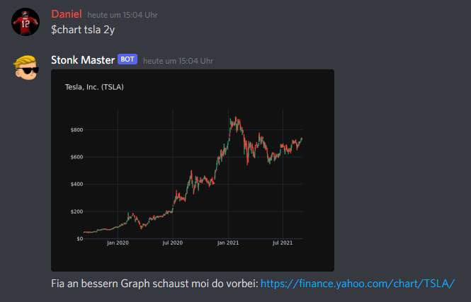
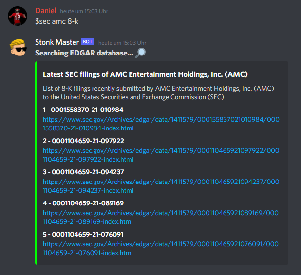

# The Stonk Master 📈💎🙌

The Stonk Master is a Discord bot for fellow apes to monitor stonks without leaving their gaming habitat. It presents information about stonks in a very easy and simple way.

## Commands

### $price \<symbol\>

Shows the current price of the stonk, as well as its daily change.

<blockquote>
    
&gt;  <i>$price AMC</i>

    
        <b>Stonk Master</b> 
        The market price of <b>AMC Entertainment Holdings, Inc. (AMC)</b> is <b>65.40$</b> (+104.12%)
</blockquote>

### $shorts \<symbol\>

Provides currently known information on how heavily the stonk is shorted.

<blockquote>
    
&gt;  <i>$shorts GME</i>

    
        <b>Stonk Master</b> 
        Currently <b>11,972,632</b> shares of <b>GameStop Corp. (GME)</b> are shorted. This corresponds to <b>29.34%</b> of available shares.
</blockquote>

### $chart \<symbol\> \<range\>

Generates a chart showing the price development of the ticker over. The range can be specified 
in days (d), months (m) or years (y).

### $sec \<symbol\> \<filing-type\>

Fetches the latest SEC company filings from EDGAR.

